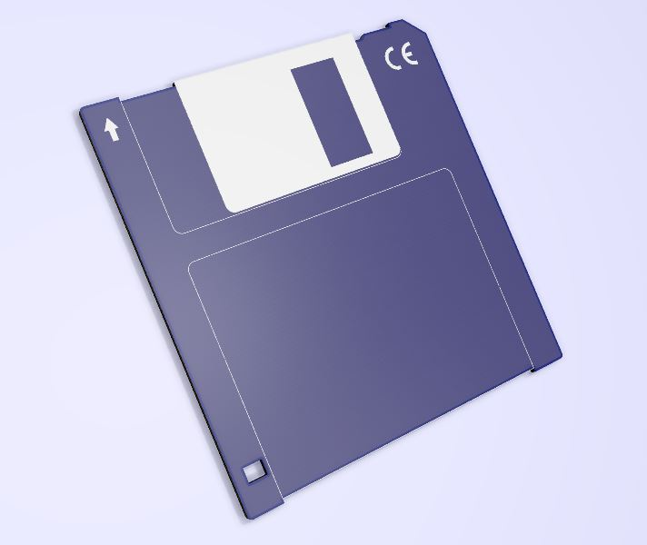

# Floppy-Disk-Coaster
A simple PCB that can be used as a coaster that looks like a 3.5 DD floppy disk.

## Info
This is a quick 30 minute project I made for my department at work. It is a 3.5" DD floppy disk that can be used as a coaster. Upload to JLCPCB, then select the PCB color you want. Add some rubber bumpers to the back, or leave it as-is. You can also modify the KiCad files to add a label or other decorative things. Another neat idea is to exclude the solder mask from the metal areas so the metal pieces show as real metal instead of silkscreen or soldermask. 
\
\

